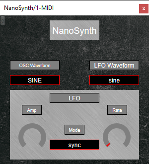
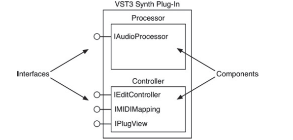
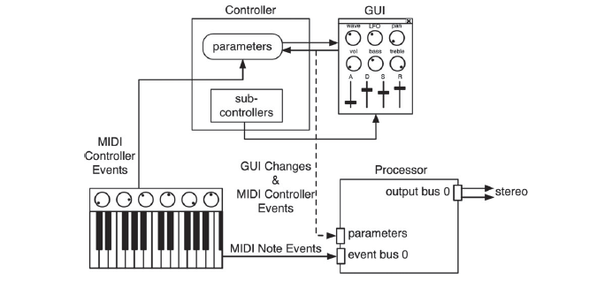

# NanoSynth

This was built with the VST3 SDK from Steinberg, available at: (https://www.steinberg.net/developers/).

## About the project

A synthesizer is an electronic musical instrument that generates audio signals. They have been around since the 60s in analog form, but made popular by soundtracks of movies such as *Blade Runner* and tv series such as *Twin Peaks*. However, this project focuses on the development of a Digital Synthesizer using the VST3 SDK in C++. The final product is a plugin that is in the Dynamic-Link Library (.dll) format, however, in VST3, you rename the extension .vst3, which then a Host (Digital Audio Workstation) uses to map it to an active MIDI Controller (any hardware that generates note data based on the playing of a user) and allows a user to create music.

### Audio example

These are examples of the sounds that NanoSynth can generate. 

### GUI

The NanoSynth comes with a basic integrated Graphic User Interface that allows the user to select the Oscillator that he will use for generating the sound, the Low Frecquency Oscillator (LFO) that will modulate the previous one, an Amplitude and a Rate Knob controller and lastly, a mode selector for the LFO. All this was done with the VSTGUI Editor Toolkit, more info available at: (https://steinbergmedia.github.io/vst3_doc/vstgui/html/index.html)

  

### Design

The way the Synthesizer plugin works is through a client-server type of scheme. Both the client and DLL/plug-in must agree on the naming of the functions and other Interface basic concepts that conform to the contract of any API. Furthermore, talking about the specifics of VST3 development, VST3 implements the Common Object Model or COM. Most of the low level COM implementations are buried deep inside of base classes so they weren't necessarily implemented by me.

### Architecture

Focusing specifically on Synth Plug-ins, the next image shows a more COM-centric view of the VST3 synth plug-in; the Processor and Controllers are in reality COM components with interfaces, represented by the circle and line.

  

On the Processor, the IAudioProcessor interface exposes other interfaces that have been used to receive MIDI events, control information, and audio I/O, however, my synth is output only. On the Controller, IEditController maintains the GUI parameters, IMIDIMapping deals with mapping the MIDI CC's to GUI parameters, and IPlugView is used to instantiate the GUI.

A general view of the NanoSynth Architecture is as the following image:

  

A MIDI controller sends note events to the Processor and control events to the Controller. The Processor has only one input bus and one output bus. It is important to note that although the Controller maintains the user interface, the Processor also receives control change information. The separation of the Controller and Processor objects is a critical part of the design paradigm in VST3, so part of writing VST3 plug-ins involves declaring variables for each GUI control.

### Theory behind a Synthesizer

As many other synthesizers, NanoSynth uses Oscillators to render audio, which are the responsables for the synthetization of waveforms. This can be done mathematically, using lookup tables, by extracting audio samples or with frequency modulation and phase modulation. In the case of the NanoSynth, I have decided, after trying to implement wavetables, that doing them mathematically was the most viable option.

There are two basic types of oscillators in a synthesizer: Low-Frequency Oscillators (LFOs) and pitched Oscillators. The LFOs potentially produce mathematically perfect waveforms since they are only used as modulators (controllers). The Oscillators were used for synthesis of the notes and therefore cannot be mathematically perfect. For my Oscillators, I used Bandlimited Step Functions Algorithms (BLEP Algorithms), which usually produce better sound because they reduce aliasing.

More info available at: (https://pbat.ch/sndkit/blep/)